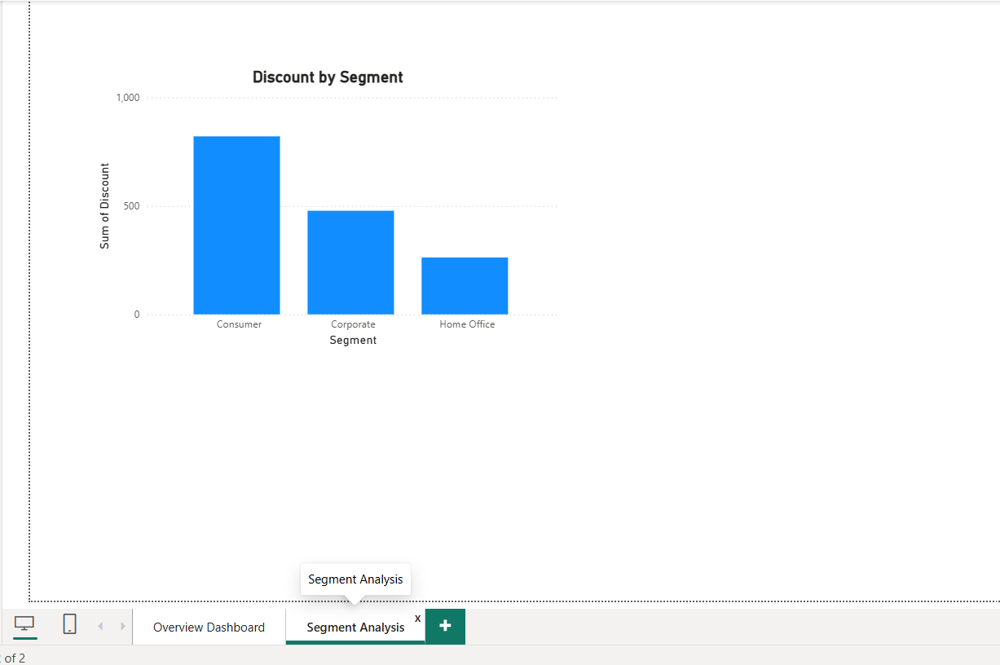

##### &#x20;                E-commerce Sales Analytics Project

**Project Overview:**

This project is a Power BI dashboard created using Excel dataset to analyze e-commerce sales performance.

It provides insights into sales, profit, discount, category, region, and segment performance.

**Objective:**

To analyze business data and create interactive visual dashboards for better decision-making.

**Tools Used:**

\- Microsoft Excel (Data Source)

\- Power BI (Data Visualization)

\- GitHub (Project Hosting)

**Project Files:**

\- Superstore_Sales_Analysis.xlsx → Raw data used for analysis  

\- Superstore\_Sales\_Profit\_Dashboard.pbix → Power BI dashboard  

\- README.md → Project documentation  

### Dashboard Overview

### Segment Analysis

**Key Insights:**

\- Sales by Category, Region, and Segment  

\- Profit distribution analysis  

\- Discount impact on sales  

\- Regional performance comparison  

**Author:**

Anaksha

**Note:**

This project demonstrates data analysis and visualization skills using Power BI.

